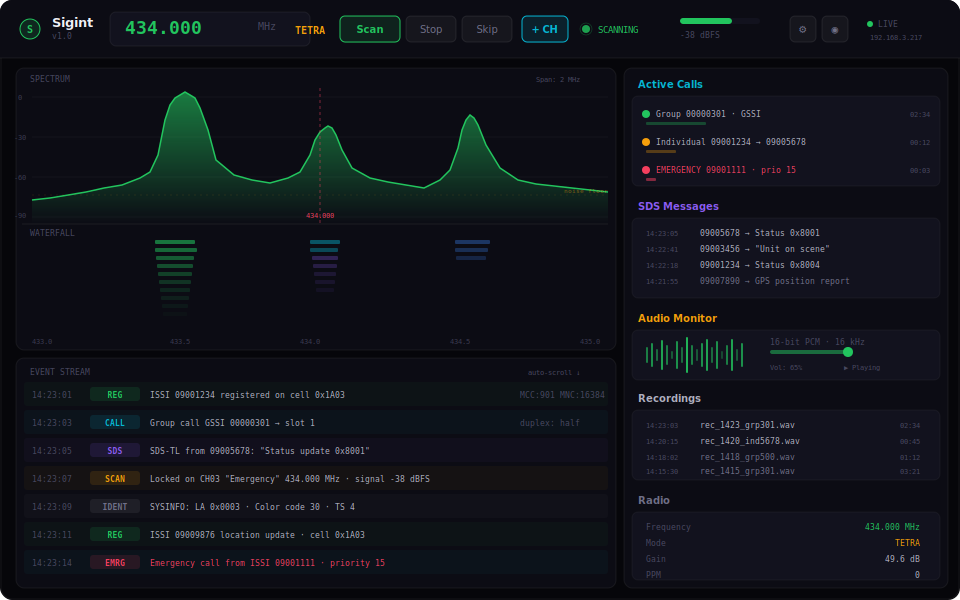
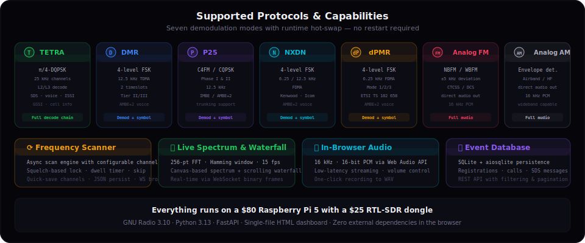
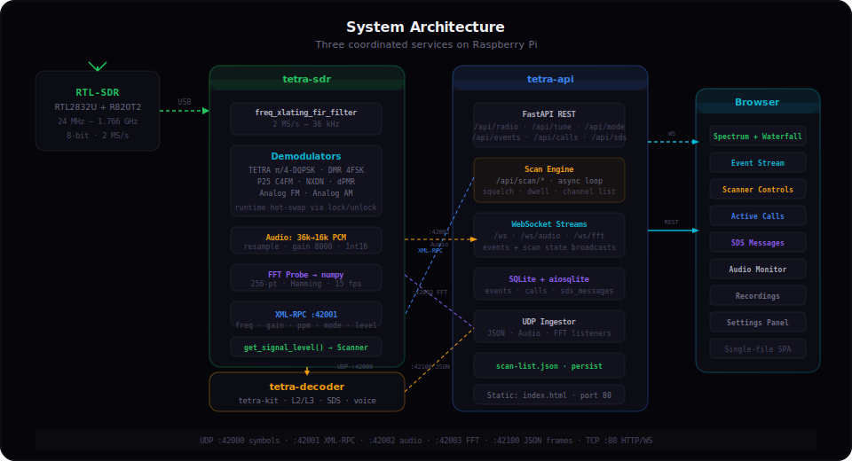

<div align="center">

# Sigint

**Autonomous multi-protocol radio scanner & decoder**

*Turn a Raspberry Pi and an RTL-SDR dongle into a full-featured signals intelligence station*

[](https://python.org)
[](https://gnuradio.org)
[](https://fastapi.tiangolo.com)
[](https://raspberrypi.com)
[](LICENSE)

</div>

---

## What is Sigint?

Sigint is a self-contained radio monitoring system that receives, demodulates, and decodes digital and analog radio signals in real time. It runs headless on a Raspberry Pi 5, serving a dark-themed web dashboard you can access from any browser on your network.

One RTL-SDR dongle. Seven protocol modes. Zero cloud dependencies.



---

## Key Features



### 7 Demodulation Modes — Hot-Swappable at Runtime
Switch between protocols without restarting the flowgraph. The GNU Radio signal chain locks, reconfigures, and unlocks in milliseconds.

| Mode | Modulation | Notes |
|------|-----------|-------|
| **TETRA** | π/4-DQPSK | Full L2/L3 decode via tetra-kit — voice, SDS, ISSI, cell info |
| **DMR** | 4FSK | Tier II/III, 12.5 kHz TDMA, 2 timeslots |
| **P25** | C4FM / CQPSK | Phase I & II, IMBE / AMBE+2 |
| **NXDN** | 4FSK | 6.25/12.5 kHz FDMA (Kenwood/Icom) |
| **dPMR** | 4FSK | 6.25 kHz FDMA, ETSI TS 102 658 |
| **Analog FM** | NBFM | Direct audio demod, ±5 kHz |
| **Analog AM** | Envelope | Airband / HF / wideband |

### Frequency Scanner
An async scan engine cycles through a user-defined channel list, locking on any signal that breaks the squelch threshold. Scanner controls live directly in the dashboard topbar — start, stop, skip, and quick-save channels with one click.

### Live Spectrum & Waterfall
A 256-point FFT with Hamming windowing streams at 15 fps over WebSocket. The dashboard renders both a spectrum trace and a scrolling waterfall using pure Canvas — no chart libraries.

### In-Browser Audio
Decoded audio streams over WebSocket as raw PCM (16 kHz, 16-bit). The Web Audio API plays it back with adjustable volume and one-click WAV recording.

### Event Database
Every decoded event — registrations, calls, SDS messages — is stored in SQLite via aiosqlite. The REST API serves them with filtering and pagination, and the dashboard displays them in a live-scrolling event stream.

---

## Architecture



Three systemd services coordinate via UDP on localhost:

**tetra-sdr** — GNU Radio flowgraph (`tetra_rx_headless.py`)
- Reads IQ samples from the RTL-SDR at 2 MS/s
- Frequency-translates and decimates to 36 kHz
- Routes through the active demodulator
- Emits symbols (UDP :42000), audio (UDP :42002), FFT (UDP :42003)
- Accepts tuning commands via XML-RPC (:42001)
- Exposes `get_signal_level()` for the scanner

**tetra-decoder** — Protocol decoder
- Consumes symbol stream on UDP :42000
- Runs tetra-kit for L2/L3 TETRA decoding
- Outputs structured JSON frames to UDP :42100

**tetra-api** — FastAPI application server (`sigint-api-main.py`)
- Ingests UDP streams (audio, FFT, decoded frames)
- Serves REST API + WebSocket streams on port 80
- Runs the async scan engine with XML-RPC control
- Hosts the single-file HTML dashboard
- Persists events to SQLite

---

## Quick Start

### Hardware
- **Raspberry Pi 5** (4 GB+ recommended)
- **RTL-SDR v3/v4** (RTL2832U + R820T2)
- Appropriate antenna for your target band

### Prerequisites
```bash
# On the Raspberry Pi (Debian 12+ / Ubuntu 24.04+)
sudo apt install gnuradio gr-osmosdr python3-numpy python3-aiosqlite python3-fastapi python3-uvicorn
```

### Deploy
```bash
# Clone the repo
git clone https://github.com/petermartis/sigint.git
cd sigint

# Copy files to the Pi
scp tetra_rx_headless.py sigint-api-main.py sigint-ingestor.py sigint-ui.html admin@<PI_IP>:/opt/tetra-scanner/

# On the Pi — set up the config
sudo mkdir -p /opt/tetra-scanner/etc
cat <<'EOF' | sudo tee /opt/tetra-scanner/etc/tetra-scanner.conf
[radio]
frequency = 434000000
gain = 49.6
ppm = 0
mode = tetra

[scanner]
enabled = false
squelch = -50
dwell = 2.0
EOF
```

### Systemd Services
Create three service units (see [SIGINT-README.md](SIGINT-README.md) for full service file contents):

```bash
sudo systemctl enable --now tetra-sdr tetra-decoder tetra-api
```

### Open the Dashboard
Point your browser to:
```
http://<PI_IP>/
```

---

## How to Use

### Tuning
Click the frequency display in the topbar or use the Settings panel to enter a frequency. The flowgraph retunes instantly via XML-RPC.

### Switching Modes
Select a protocol from the mode dropdown. The GNU Radio chain hot-swaps demodulator blocks without restarting — the lock/unlock cycle takes milliseconds.

### Using the Scanner
1. **Add channels** — Click `+ CH` in the topbar to quick-save the current frequency, or open Settings → Scanner to manage the full channel list.
2. **Start scanning** — Click `Scan`. The engine cycles through channels, pausing on any signal above the squelch threshold.
3. **Skip** — Click `Skip` to move to the next channel immediately.
4. **Configure** — Adjust squelch level (dBFS) and dwell time (seconds) in Settings → Scanner.

### Monitoring Audio
Click the speaker icon to unmute. Audio streams in real time via WebSocket → Web Audio API. Hit the record button to capture a WAV file directly in the browser.

### Reviewing Events
The event stream panel shows decoded events as they arrive — registrations, group/individual calls, SDS messages, system info. Each event type is color-coded. Historical events are available via the REST API:

```bash
# Get the latest 50 events
curl http://<PI_IP>/api/events?limit=50

# Get SDS messages
curl http://<PI_IP>/api/sds

# Get active calls
curl http://<PI_IP>/api/calls
```

### REST API
The full API is documented at `http://<PI_IP>/docs` (auto-generated Swagger UI).

Key endpoints:
- `GET /api/radio` — Current radio state (frequency, mode, gain, signal level)
- `POST /api/tune` — Set frequency
- `POST /api/mode` — Switch demodulation mode
- `GET /api/events` — Paginated event history
- `GET /api/scan/status` — Scanner state
- `POST /api/scan/start` — Start scanning
- `POST /api/scan/stop` — Stop scanning
- `GET /api/scan/channels` — List saved channels
- `POST /api/scan/channels` — Add a channel
- `DELETE /api/scan/channels/{id}` — Remove a channel

---

## Tech Stack

| Layer | Technology |
|-------|-----------|
| SDR Hardware | RTL-SDR v3/v4 (RTL2832U + R820T2) |
| Signal Processing | GNU Radio 3.10, gr-osmosdr |
| Protocol Decoder | tetra-kit (TETRA L2/L3) |
| API Server | Python 3.13, FastAPI, uvicorn, aiosqlite |
| Transport | UDP (symbols, audio, FFT, JSON), XML-RPC, WebSocket |
| Database | SQLite |
| Frontend | Single-file HTML/CSS/JS — Canvas, Web Audio API, zero dependencies |
| Platform | Raspberry Pi 5, Debian 13 (trixie), aarch64 |

---

## Project Structure

```
sigint/
├── tetra_rx_headless.py    # GNU Radio flowgraph (7 demod modes, FFT, XML-RPC, UDP output)
├── sigint-api-main.py      # FastAPI server (REST, WebSocket, scan engine, SQLite)
├── sigint-ingestor.py       # UDP ingestor module (audio, FFT, JSON frame listeners)
├── sigint-ui.html           # Single-file web dashboard (HTML + CSS + JS)
├── SIGINT-README.md         # Full technical reference & deployment guide
└── docs/
    ├── architecture.svg     # System architecture diagram
    ├── dashboard-mockup.svg # Dashboard UI mockup
    └── features.svg         # Protocol & feature overview
```

---

## Full Documentation

See **[SIGINT-README.md](SIGINT-README.md)** for the complete technical reference, including:
- Detailed service configuration
- systemd unit files
- UDP protocol formats
- XML-RPC API reference
- Troubleshooting guide
- Hardware setup notes

---

<div align="center">

*Built with GNU Radio, FastAPI, and too many hours staring at waterfall displays.*

</div>
